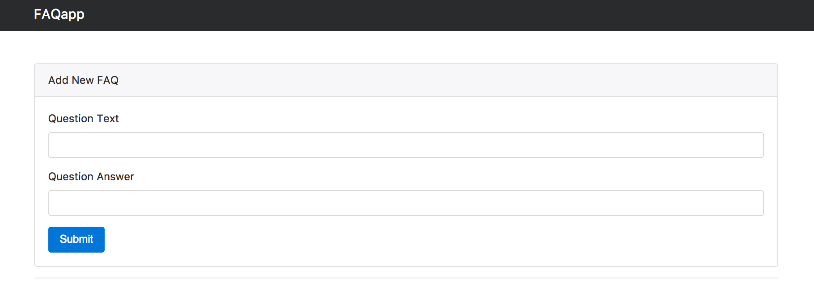

# FaqApp



Simple Questions and Answers Application

## Functionality
- Form to add questions and answers, it enable users to toggle and delete them as well
- Pushing questions and answers to localstorage, even if we refreash the page.

## Technologies

- Angular 4
- HTML5/CSS
- TypeScript
- Bootstrap 4 Alpha
- Jquery
- Tether
- git


## Installation
#### Angular CLI
```
ng new faqApp
cd faqApp
ng serve --open
```
#### Bootstrap
```
npm install bootstrap@4.0.0-alpha.6 jquery tether --save
```
##### Adding dependecies to angular-cli.json
```javascript
"styles": [
    "style.css",
    "../node_modules/bootstrap/dist/css/bootstrap.css" // <- added this line
]
```

```javascript
 "scripts": [
        "../node_modules/jquery/dist/jquery.js", // <- added this line
        "../node_modules/tether/dist/js/tether.js", // <- added this line
        "../node_modules/bootstrap/dist/js/bootstrap.js" // <- added this line
      ]
```
## Deploy with github pages

``` bash
# First install angular-cli-ghpages globally
$ npm install -g angular-cli-ghpages
# Angular CLI with the --base-href
$ ng build --prod --base-href "https://<user-name>.github.io/<repo>/"
# To publish the app
$ ngh
```

## License
The MIT License